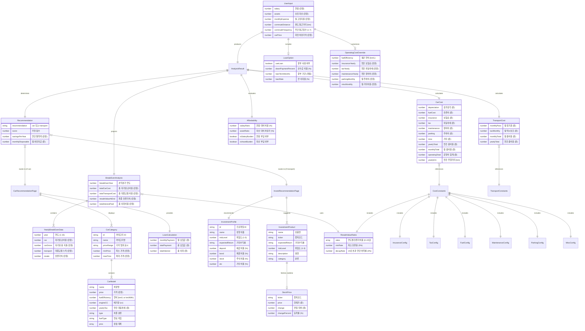

# ERD (Entity Relationship Diagram)

## 차 vs 대중교통 | 데이터 모델 설계서

**문서 버전**: v1.0
**작성일**: 2026-02-13

---

## 1. 아키텍처 개요

본 서비스는 **서버리스 클라이언트 중심 아키텍처**로, RDBMS 없이 다음 3가지 계층의 데이터를 사용합니다.

```
┌─────────────────────────────────────────────────────────┐
│                     Client (Browser)                     │
│                                                          │
│  ┌──────────────┐   ┌───────────────┐   ┌────────────┐  │
│  │ sessionStorage│   │  localStorage  │   │  React     │  │
│  │ (폼 입력 보존) │   │ (분석 데이터)   │   │  State     │  │
│  └──────┬───────┘   └───────┬───────┘   └─────┬──────┘  │
│         │                   │                  │         │
│         └───────────────────┼──────────────────┘         │
│                             │                            │
│                    ┌────────▼────────┐                   │
│                    │  Calculation    │                   │
│                    │  Engine         │                   │
│                    └────────┬────────┘                   │
│                             │                            │
│               ┌─────────────┼─────────────┐              │
│               ▼             ▼             ▼              │
│        ┌───────────┐ ┌───────────┐ ┌───────────┐        │
│        │ Static    │ │ Static    │ │ Static    │        │
│        │ Constants │ │ Car Data  │ │ Investment│        │
│        │           │ │           │ │ Data      │        │
│        └───────────┘ └───────────┘ └───────────┘        │
└─────────────────────────────────────────────────────────┘
                             │
                             │ fetch (API Routes)
                             ▼
┌─────────────────────────────────────────────────────────┐
│                   Server (Next.js API)                   │
│                                                          │
│  ┌────────────────┐ ┌──────────────┐ ┌───────────────┐  │
│  │ /api/fuel-price │ │ /api/stocks  │ │ /api/exchange │  │
│  │ (30분 캐시)     │ │ (15분 캐시)   │ │ (1시간 캐시)  │  │
│  └───────┬────────┘ └──────┬───────┘ └───────┬───────┘  │
│          ▼                 ▼                  ▼          │
│   OPINET / Naver     Yahoo Finance    Korea Exim Bank   │
└─────────────────────────────────────────────────────────┘
```

---

## 2. 엔티티 관계도 (Mermaid)



---

## 3. 데이터 저장소별 상세

### 3.1 sessionStorage: `finance-input-form`

폼 입력값 보존용. 사용자가 필드를 변경할 때마다 즉시 저장되며, 페이지 재방문 시 자동 복원됩니다.

```json
{
  "salary": "4,000",
  "assets": "5,000",
  "monthlyExpense": "150",
  "commuteDistance": "15",
  "commuteFrequency": "5",
  "carPrice": "3,000",
  "useLoan": false,
  "downPaymentPercent": "30",
  "loanTermMonths": "48",
  "loanRate": "4.5",
  "fuelEfficiency": "12.5",
  "insuranceYearly": "",
  "taxYearly": "",
  "maintenanceYearly": "80",
  "parkingMonthly": "12",
  "miscMonthly": "5"
}
```

| 필드 | 타입 | 저장 형태 | 비고 |
|---|---|---|---|
| salary, assets, monthlyExpense, carPrice | string | 콤마 포맷 (`"4,000"`) | `parseFormattedNumber()`로 파싱 |
| commuteDistance, fuelEfficiency 등 | string | 숫자 문자열 (`"15"`) | `parseFloat()`로 파싱 |
| useLoan | boolean | `true`/`false` | 토글 상태 |
| insuranceYearly, taxYearly | string | 빈 문자열 = 자동 계산 | 미입력 시 엔진이 자동 산출 |

### 3.2 localStorage: `finance-input`

제출된 분석용 데이터. 콤마 포맷이 제거된 숫자 값으로 저장됩니다.

```json
{
  "salary": 4000,
  "assets": 5000,
  "monthlyExpense": 150,
  "commuteDistance": 15,
  "commuteFrequency": 5,
  "carPrice": 3000,
  "useLoan": false,
  "downPaymentPercent": 30,
  "loanTermMonths": 48,
  "loanRate": 4.5,
  "fuelEfficiency": 12.5,
  "maintenanceYearly": 80,
  "parkingMonthly": 12,
  "miscMonthly": 5
}
```

### 3.3 서버 메모리 캐시 (API Route 내부)

```javascript
// 공통 캐시 패턴
const cache = {
  data: null,       // 캐시된 응답 데이터
  timestamp: 0,     // 마지막 갱신 타임스탬프
};
const CACHE_TTL = N; // 밀리초 단위

// 조회 시: Date.now() - cache.timestamp < CACHE_TTL → 캐시 반환
```

| API | 캐시 키 | TTL | 데이터 구조 |
|---|---|---|---|
| `/api/fuel-price` | `cache` (모듈 스코프) | 30분 | `{ gasoline, diesel, lpg, source, date }` |
| `/api/exchange-rate` | `cache` (모듈 스코프) | 1시간 | `{ usd, eur, jpy, source, date }` |
| `/api/stocks` | `cache` (모듈 스코프) | 15분 | `{ [ticker]: { price, change, changePercent } }` |

---

## 4. 정적 데이터 엔티티 상세

### 4.1 CAR_COSTS (비용 상수)

```
CAR_COSTS
├── DEPRECIATION_RATES          # 연도별 감가상각률 (정률법)
│   ├── year1: 25%
│   ├── year2: 17%
│   ├── ...
│   ├── year10: 5%
│   └── default: 4%
│
├── RESALE_VALUE_RATES[]        # 연도별 잔존가치율 (16개 원소)
│   ├── [0] 1.00 (신차)
│   ├── [1] 0.82
│   ├── ...
│   └── [15] 0.16
│
├── DEPRECIATION_MODIFIER       # 차종별 감가 보정 배율
│   ├── domestic: 1.0
│   ├── imported: 1.15
│   ├── electric: 1.25
│   ├── hybrid: 0.90
│   └── luxury: 1.20
│
├── INSURANCE                   # 보험료 설정
│   ├── rate: 3.5%
│   ├── min: 600,000원
│   ├── max: 2,000,000원
│   └── ageModifier{}           # 운전자 연령별 할증
│
├── TAX                         # 자동차세
│   ├── under2000: 300,000원
│   ├── under3000: 450,000원
│   ├── under5000: 520,000원
│   ├── over5000: 650,000원
│   ├── electric: 130,000원
│   └── ageDiscount{}           # 차령별 경감률
│
├── FUEL                        # 유류비 (5개 연료 타입)
│   ├── gasoline: { pricePerLiter, avgEfficiency }
│   ├── diesel: { pricePerLiter, avgEfficiency }
│   ├── lpg: { pricePerLiter, avgEfficiency }
│   ├── electric: { pricePerKwh, avgEfficiency }
│   └── hybrid: { pricePerLiter, avgEfficiency }
│
├── MAINTENANCE                 # 정비비 (연료 타입별)
│   ├── gasoline: 800,000원
│   ├── diesel: 900,000원
│   ├── hybrid: 700,000원
│   ├── electric: 400,000원
│   └── yearly: 800,000원 (기본)
│
├── PARKING                     # 주차비
│   ├── monthly: 120,000원 (기본)
│   └── byRegion{}              # 지역별
│
├── MISC                        # 기타 비용
│   ├── monthly: 50,000원
│   └── 세부항목 (carWash, toll, inspection, accessories)
│
└── ACQUISITION_TAX             # 취득세
    ├── rate: 7%
    ├── electric: 4%
    └── economyCar: 4%
```

### 4.2 TRANSPORT_COSTS (대중교통 상수)

```
TRANSPORT_COSTS
├── MONTHLY_PASS: 65,000원
├── MONTHLY_PASS_BY_REGION{}    # 지역별 정기권
├── TAXI_MONTHLY                # 택시 보조비 (거리별)
│   ├── low: 50,000원    (≤10km)
│   ├── medium: 100,000원 (≤25km)
│   └── high: 150,000원   (>25km)
├── SHARED_MOBILITY{}           # 공유 모빌리티
└── LATE_NIGHT_SURCHARGE{}      # 야간 할증
```

### 4.3 CAR_CATEGORIES (차량 데이터)

```
CAR_CATEGORIES[] ─── 5개 카테고리
│
├── [0] economy (경차/소형)
│   ├── priceRange: "1,000~2,000만원"
│   └── cars[]: 모닝, 캐스퍼, 아반떼, 레이, 스파크
│
├── [1] mid (준중형/중형)
│   ├── priceRange: "2,000~3,500만원"
│   └── cars[]: 쏘나타, K5, 투싼, 쏘나타 HEV, 니로 HEV, QM6
│
├── [2] upper (중대형/대형)
│   ├── priceRange: "3,500~5,000만원"
│   └── cars[]: 그랜저, K8, 싼타페, 그랜저 HEV, 쏘렌토, EV6
│
├── [3] premium (프리미엄)
│   ├── priceRange: "5,000~8,000만원"
│   └── cars[]: G80, GV70, BMW 3, 벤츠 C, 테슬라 3, 아이오닉 5
│
└── [4] luxury (럭셔리)
    ├── priceRange: "8,000만원 이상"
    └── cars[]: G90, BMW 5, 벤츠 E, 테슬라 Y, GV80
```

**CarModel 속성:**

| 속성 | 타입 | 설명 | 예시 |
|---|---|---|---|
| name | string | 차량명 | "현대 쏘나타" |
| price | number | 가격 (만원) | 2800 |
| fuelEfficiency | number | 연비 | 13.8 (km/L) 또는 5.6 (km/kWh) |
| engineCC | number | 배기량 | 1999 (전기차: 0) |
| yearlyTax | number | 자동차세 (원) | 520000 |
| type | string | 차종 분류 | "중형", "SUV", "전기 SUV" |
| fuelType | string | 연료 타입 | "gasoline", "diesel", "hybrid", "electric" |
| pros | string[] | 장점 목록 | ["넓은 실내공간", "편안한 승차감"] |

### 4.4 INVESTMENT_PROFILES & RECOMMENDED_PRODUCTS (투자 데이터)

```
INVESTMENT_PROFILES{} ─── 3개 투자 성향
│
├── conservative (안정형)
│   ├── riskLevel: 1, expectedReturn: "3~5%"
│   └── allocation: { deposit:40, bond:35, stock:15, etc:10 }
│
├── balanced (균형형)
│   ├── riskLevel: 2, expectedReturn: "5~8%"
│   └── allocation: { deposit:20, bond:25, stock:40, etc:15 }
│
└── aggressive (성장형)
    ├── riskLevel: 3, expectedReturn: "8~12%"
    └── allocation: { deposit:10, bond:10, stock:65, etc:15 }

RECOMMENDED_PRODUCTS{} ─── 5개 카테고리
│
├── deposit[5]   예금/적금: 정기예금, 적금, CMA, 청년도약계좌, ISA
├── bond[4]      채권 ETF: KODEX 국고채10년, TIGER 미국채10년선물 등
├── etf[11]      ETF: 지수(5), 배당(2), 섹터(3), 리츠(1)
├── stocks[10]   개별주식: 대형주(4), 성장주(3), 배당주(3)
└── etc[2]       대체자산: KODEX 골드선물, KODEX 은선물
```

---

## 5. 데이터 흐름도 (Data Flow)

### 5.1 입력 → 분석 → 결과

```
[InputForm]                    [sessionStorage]
    │                               ▲
    │  handleChange()               │ saveToSession()
    │──────────────────────────────►│
    │                               │
    │  handleSubmit()          [localStorage]
    │────── parse & save ─────────►│
    │                               │
    │  router.push('/result')       │
    ▼                               │
[ResultDashboard]                   │
    │                               │
    │  useEffect: read ◄────────────┘
    │
    │  fetch('/api/fuel-price') ──► [Server: OPINET/Naver/Fallback]
    │  ◄── fuelPrice ──────────────┘
    │
    │  makeRecommendation(inputs)
    │       │
    │       ├── calculateCarCosts(inputs)
    │       │   └── CAR_COSTS 상수 참조
    │       │
    │       ├── calculateTransportCosts(inputs)
    │       │   └── TRANSPORT_COSTS 상수 참조
    │       │
    │       ├── calculateAffordability(salary, assets, carPrice, yearlyCarCost)
    │       │
    │       ├── calculateBreakEvenPoint(inputs)
    │       │   ├── getResaleRate(year) × 15년 반복
    │       │   └── 할부 원리금 상환 시뮬레이션
    │       │
    │       └── 점수 기반 추천 결정 (8개 판단 기준)
    │
    ▼
[Result Components]
    ├── RecommendationBanner: recommendation, score, reasons
    ├── GaugeCard ×2: affordability
    ├── CostComparisonCard: carCosts, transportCosts
    ├── BreakEvenChart: breakEven.data[] (3 lines)
    └── CostPieChart: carCosts (7 cost items)
```

### 5.2 차량 추천 흐름

```
[CarPage]
    │  useEffect: localStorage.read('finance-input')
    │
    ├── [CarRecommendation]
    │   │  inputs.carPrice → 카테고리 매칭
    │   │  CAR_CATEGORIES → 차량 목록 렌더
    │   └── calculateCarCosts() → 차량별 월비용 산출
    │
    └── [LoanCalculator]
        │  carPrice + downPayment + termMonths + rate
        └── calculateLoan() → 월 납입금, 총 이자 산출
```

### 5.3 투자 추천 흐름

```
[InvestPage]
    │  useEffect: localStorage.read('finance-input')
    │  makeRecommendation(inputs) → savingsPerYear
    │  recommendInvestmentProfile(salary, assets) → profile
    │
    ├── [InvestmentStrategy]
    │   │  INVESTMENT_PROFILES[profile]
    │   └── 3개 포트폴리오 카드 + 자산배분 표시
    │
    ├── [StockRecommendation]
    │   │  RECOMMENDED_PRODUCTS (etf, stocks, deposit, bond)
    │   │  fetch('/api/stocks') → 실시간 시세 병합
    │   └── 위험도 필터링 (profile 기반 maxRisk)
    │
    └── [AllocationChart]
        │  INVESTMENT_PROFILES[profile].allocation
        │  COMPOUND_INTEREST[profile] × 10년
        └── 도넛 차트 + 복리 시뮬레이션
```

---

## 6. 엔티티 간 관계 요약표

| From | Relation | To | Cardinality | 설명 |
|---|---|---|---|---|
| UserInput | produces | AnalysisResult | 1:1 | 입력 1건당 분석결과 1건 |
| UserInput | includes | LoanOption | 1:0..1 | 할부 옵션 선택 시에만 |
| UserInput | customizes | OperatingCostOverride | 1:0..1 | 상세 설정 시에만 |
| AnalysisResult | calculates | CarCost | 1:1 | |
| AnalysisResult | calculates | TransportCost | 1:1 | |
| AnalysisResult | evaluates | Affordability | 1:1 | |
| AnalysisResult | projects | BreakEvenAnalysis | 1:1 | |
| BreakEvenAnalysis | contains | YearlyBreakEvenData | 1:15 | 15년치 데이터 |
| AnalysisResult | determines | Recommendation | 1:1 | |
| Recommendation | routes to | CarPage / InvestPage | 1:1 | 결과에 따라 분기 |
| CarCategory | contains | CarModel | 1:N | 카테고리당 5~6개 차종 |
| InvestmentProfile | suggests | InvestmentProduct | 1:N | 위험도 필터링 |
| InvestmentProduct | fetches | StockPrice | 0..1:0..1 | ticker 있는 상품만 |
| CarCost | references | CostConstants | N:1 | 비용 상수 참조 |
| TransportCost | references | TransportConstants | N:1 | |
| BreakEvenAnalysis | uses | ResaleValueRates | N:1 | 잔존가치율 참조 |

---

## 7. 데이터 검증 규칙

### 7.1 입력값 검증

| 필드 | 규칙 | 에러 메시지 |
|---|---|---|
| salary | ≥ 100 (만원) | "연봉을 100만원 이상 입력해주세요" |
| assets | ≥ 0 | "보유 자산을 입력해주세요" |
| monthlyExpense | 필수 | "월 고정 지출을 입력해주세요" |
| commuteDistance | > 0 | "통근 거리를 입력해주세요" |
| commuteFrequency | 1~7 | "주 1~7회로 입력해주세요" |
| carPrice | ≥ 500 (만원) | "희망 차량 가격을 500만원 이상 입력해주세요" |
| downPaymentPercent | 0~100 (%) | "선수금 비율을 0~100% 사이로 입력해주세요" |
| loanTermMonths | 6~120 (개월) | "할부 기간을 6~120개월 사이로 입력해주세요" |
| loanRate | 0~30 (%) | "금리를 0~30% 사이로 입력해주세요" |

### 7.2 계산 경계값

| 항목 | 경계 | 처리 |
|---|---|---|
| 보험료 | min 60만 / max 200만 | Clamp |
| 잔존가치율 (15년 초과) | 연 2% 하락, 최소 5% | `Math.max(0.05, ...)` |
| 대출 잔액 | 음수 방지 | `Math.max(0, loanBalance - payment)` |
| 월 이자율 0% | 0 나누기 방지 | 별도 분기 처리 |

---

## 8. 향후 확장 고려사항

본 ERD는 현재 클라이언트 사이드 데이터 모델 기반이지만, DB 도입 시 아래와 같이 확장할 수 있습니다.

| 현재 | DB 도입 시 |
|---|---|
| localStorage / sessionStorage | Users 테이블 + AnalysisHistory 테이블 |
| 정적 JS 상수 | CostConfig / CarCatalog 관리 테이블 |
| API 메모리 캐시 | Redis 캐시 레이어 |
| 클라이언트 계산 | 서버 사이드 계산 + 결과 저장 |

```
[확장 DB 스키마 예시]

Users
├── id (PK)
├── email
└── created_at

AnalysisHistory
├── id (PK)
├── user_id (FK → Users)
├── inputs (JSON)
├── result (JSON)
├── recommendation (enum: car/transport)
└── created_at

CostConfig
├── id (PK)
├── key (unique)
├── value (JSON)
└── updated_at
```
